# Introduce

### 인적사항

1. 이름 : `김혜민 kim hye min`
1. 생년월일 : `98/10/02`
1. 학적 : `한림대학교 스마트 IOT학과`
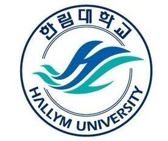

### 장학금 수혜

1. `1학년 1~2학기 인재 장학금 (전액)`
1. `2학년 1학기 성적 장학금 (30%)`
1. `2학년 2학기 성적 장학금 (60%)`

### 사용 가능 프로그래밍 언어
- **java script**
- **python**
- **java**
- **c**
- **c++**
- **linux**

### 사용 가능 프로그래밍 툴

- [jupyter notebook](https://jupyter.org/install)
- [arduino](https://www.arduino.cc/en/software)
- [Rstudio](https://rstudio.com/products/rstudio/download/)
- [Xshell](https://www.netsarang.com/ko/xshell/)
- [visual studio](https://visualstudio.microsoft.com/ko/)
- [virtual box](https://www.virtualbox.org/wiki/Downloads)
- [Wireshark](https://www.wireshark.org/)
- logicworks

***
							<page 1>

---

# MY Travel

- *Danang*

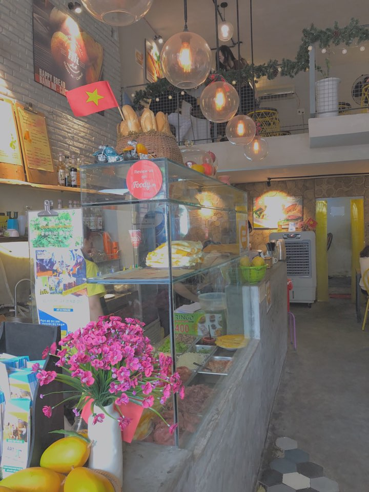


- *Saipan*


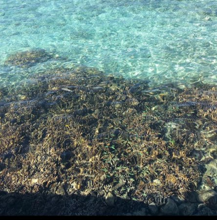


- *Guam*


- *Cebu*


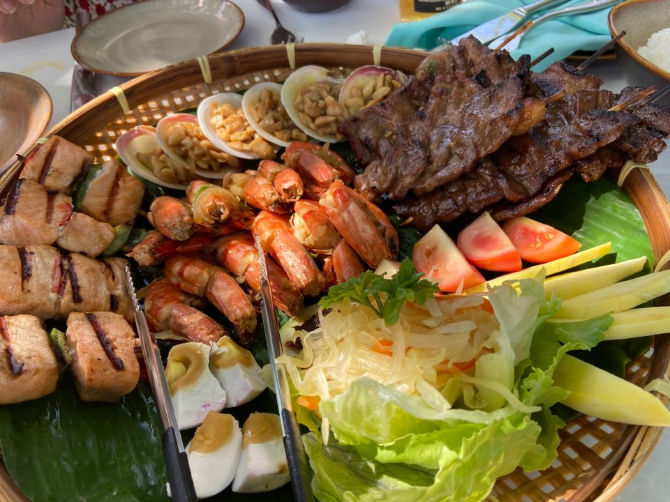
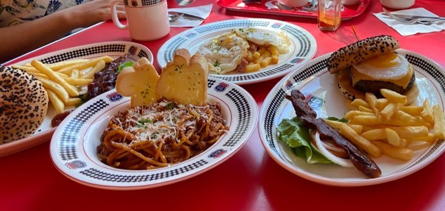

***
							<page 2>

---


# 구현 program

## java script
### - 치매 예방 프로그램
#### 일부 `code`
```js
var mes,i,res1,res2,suc,fail,wch,yet;

	var a=["체리","포도","딸기","멜론"]; 
 	var b=["아이스아메리카노","유자차","아이스크림","카페라떼"]; 
	var c=["냉면","칼국수","막국수","된장찌개"];

	choice=eval(prompt("  *** 배고픈 물개에게 음식을 줍시다 !! *** \n 주고 싶은 카테고리를 선택해주세요.^^\n 1. 과일 2. 디저트 3. 밥 "),"");
	mes=" ** 분류가 잘못 되면 게임이 종료됩니다. ** \n 준비가 되셨다면 확인을 눌러서 게임을 시작해 주세요~";	

	suc="완벽해요..!!!!!  물개는 이제 행복합니다.^0^";
	fail="틀리셨습니다 ! 게임을 종료 합니다.";
	wch="숫자를 잘못 입력 하셨습니다.. 게임을 종료합니다.";
	yet="준비가 안되셨군요,,, 마음의 준비 하시고 다시 시도 해 주세요. 종료합니다.";

	if(choice==1)
	{
		res=confirm(" [ 과일 ]을 선택 하셨습니다 ! \n  물개는 오직 빨간 과일만을 먹습니다. \n  빨간 과일이 나오면 확인을,  그 외의 것이 나오면\n 취소를 눌러서 과일을 분류해주세요^^\n  " + mes);
	              if(res==true)
		{
			for(i=0;i<4;i++)
			{
				if(i%2==0)
					res1=confirm(a[i]);
				else
					res2=confirm(a[i]);
			}

		       if(res1==true && res2==false)
	                     {
			document.write(suc);
	                      }

		       else
			document.write(fail);
			
	
		}	
		else
		   document.write(yet);
		
	}
```
#### result
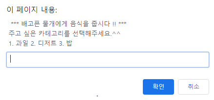
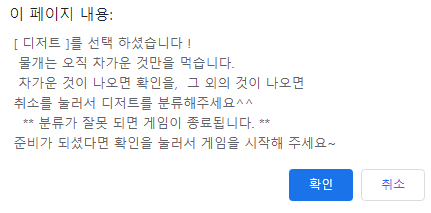
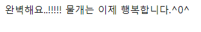


## python
### - 캐릭터 만들기
#### 일부 `code`

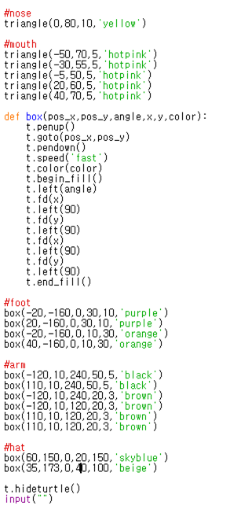

#### result
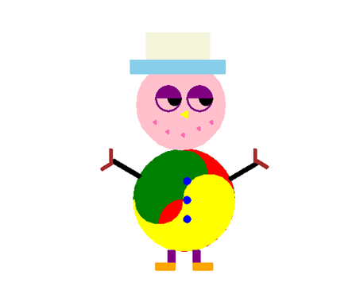


***
							<page 3>

---

## 논리설계및실험
### - 브레드보드 / logicworks 이용

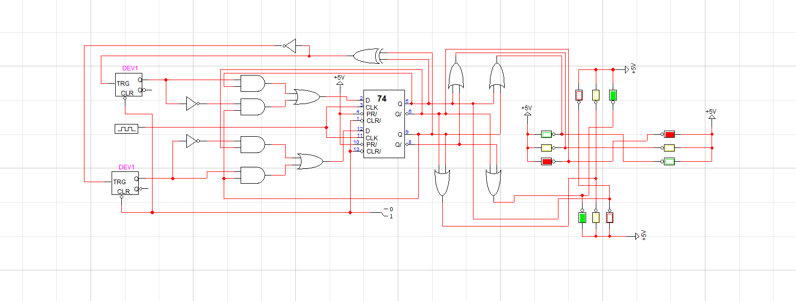
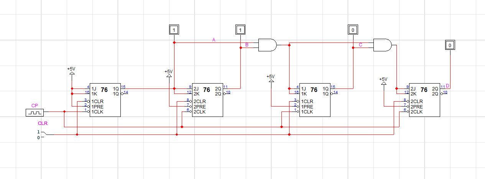
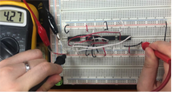

## 데이터 통신
### - 패킷 교환 프로그램 

## IoT 머신러닝
### - 아두이노, 센서 이용
### - 부저모듈을 이용해서 SOS 를 연속 출력 
`code`
```
int buzzer = 8;
int length_short = 200;
int length_long = length_short*3;

void setup() {
 pinMode(buzzer, OUTPUT);
}

void dot() {
 digitalWrite(buzzer, HIGH);
 delay(length_short);
 digitalWrite(buzzer, LOW);
 delay(length_short);
}

void dash() {
 digitalWrite(buzzer, HIGH);
 delay(length_long);
 digitalWrite(buzzer, LOW);
 delay(length_short);
}

void loop() {
 dot();dot();dot();delay(length_short*2);
 dash();dash();dash();delay(length_short*2);
 dot();dot();dot();delay(length_short*2);
 delay(length_short*6);
} 
```
## 데이터 시각화
### - Rstudio를 이용한 시각화 프로그램 구현
`code`

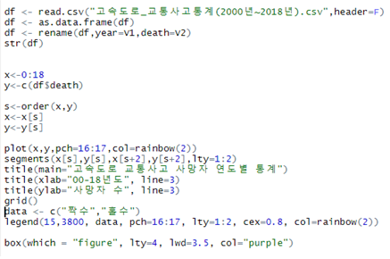
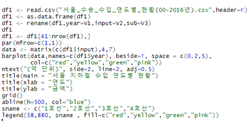
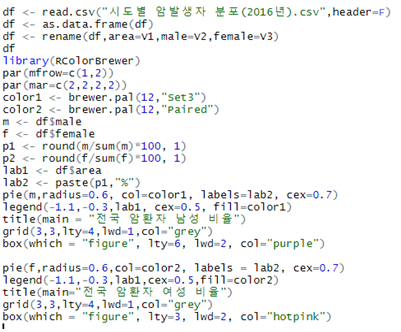

result

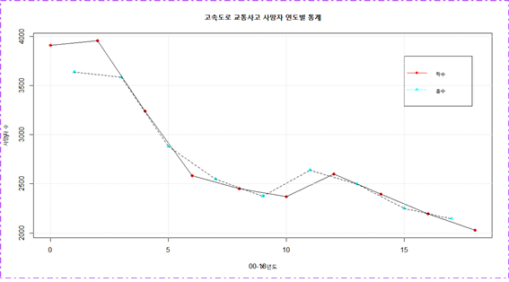
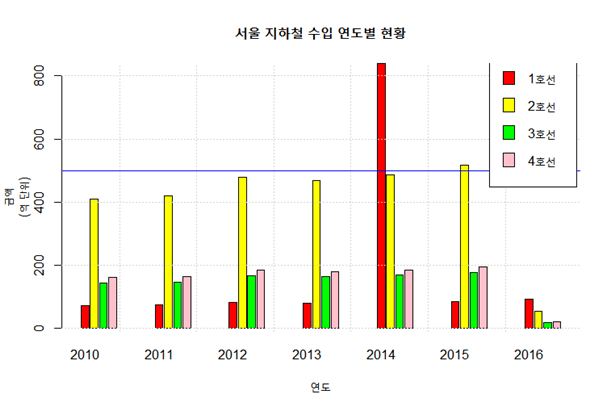
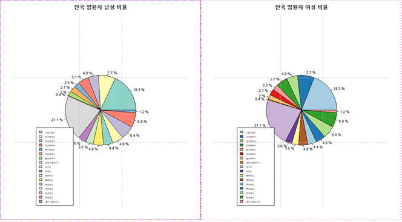

## 클라우드컴퓨팅
### - AWS를 이용한 프로젝트 구현 준비 중 


***
							<page 4>

---

# My plan
+ **자격증**

| exam | date |
|------|------|
| 컴퓨터활용능력 1급 실기 | 20/11/15 |
| Toeic | 20/12|
| 정보처리기사 | 2022|
| |

+ **3-2학기 성적 장학금**


# 관심 기술

### AI 기술
- 언택트 기술:
	+ [언택트의 중심 AI](http://naver.me/FTnYnQES)
	+ [언택트 시대, AI 헬스케어](http://naver.me/IIxaxio4)


### 5G 기술
-  [sk텔레콤  5G](http://naver.me/GyjJjlCj)
-  [수자원공사 5G](http://naver.me/GqHaHhOR)


### 클라우드, IoT기술

- [MS 홀로렌즈2](http://naver.me/xOf3fR9T)


***
							<page 5>

---